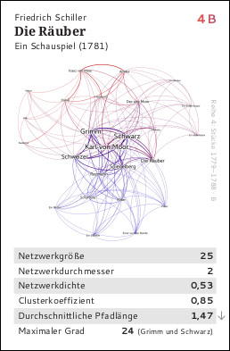
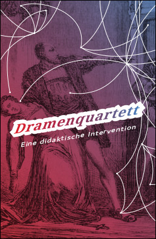

# Dramenquartett
## Eine didaktische Intervention

Hier findest du die Spielregeln für das Dramenquartett. Auf jeder der 32 Karten ist ein soziales Netzwerk abgebildet, das aus einem deutschsprachigen Drama extrahiert wurde, auf Basis der Kopräsenz von Figuren.

Frank Fischer und Anika Schultz: *Dramenquartett. Eine didaktische Intervention.* Bern: edition taberna kritika 2019. 32 Blatt in Kartonbox, Farbdruck. ISBN: 978-3-905846-55-3. Preis: **€14** / **17 SFr.** ([im VLB](https://www.buchhandel.de/buch/Dramenquartett-9783905846553), [beim Verlag](http://www.etkbooks.com/dramenquartett/))

Es kann auch eine Version zum Selbstdruck heruntergeladen werden: [hier ohne](https://github.com/lehkost/dramenquartett/blob/master/print-version/dramenquartett_etk_books_2019.pdf) und hier [mit Schnittkante](https://github.com/lehkost/dramenquartett/raw/master/print-version/dramenquartett_etk_books_2019.pdf).

### Idee

Mittels der automatischen Extraktion kommunikativer Beziehungen zwischen Figuren in fiktionalen Texten können umfangreiche Textkorpora analysiert werden. Allgemeine Strukturentwicklungen in den Nationalliteraturen lassen sich so auf einer neuen quantitativen Basis beschreiben.

Die Anwendung netzwerkanalytischer Termini in der Literaturwissenschaft ist keineswegs selbstverständlich, die Interpretation der berechneten Werte alles andere als trivial. Was bedeutet es zum Beispiel, dass die durchschnittliche Pfadlänge in Kleists »Hermannsschlacht« genau 2,58 beträgt? Setzt man diesen Wert jedoch in Beziehung zu entsprechenden Werten anderer Stücke, gewinnt er an komparativer Signifikanz.

Das Dramenquartett soll dazu dienen, spielerisch ein Gefühl für die Bedeutung solcher Werte zu entwickeln. Durch die Einübung in die strukturalistische Betrachtung von Netzwerken am Beispiel von Dramen wird dabei im besten Fall auch kulturelles Grundwissen über die Strukturation von Netzwerken allgemein erworben. 

### Knoten und Kanten

Die Extraktion der Figurenbeziehungen folgt einer einfachen Operationalisierung: Alle sprechenden Figuren eines Stückes werden als Knoten in den Graphen übernommen.

Eine Beziehung zwischen den einzelnen Knoten wird dann als Kante etabliert, wenn die beiden entsprechenden Figuren einen Sprechakt im selben Segment (einer Szene oder einem Akt) vollziehen. Zudem sind die Kanten gewichtet. Das heißt, je öfter zwei Figuren als Sprecher in gemeinsamen Szenen auftreten, desto höher ist der entsprechende Verknüpfungswert, was sich als entsprechend dickere Kante in der Graphvisualisierung manifestiert.

Nachbearbeitet wurden die Graphen mit Gephi, als Layoutalgorithmus wurde im Normalfall »Force Atlas 2« benutzt.

Die Größe der Knoten und Labels entspricht meist dem jeweiligen gewichteten Grad. Der Farbverlauf von Rot nach Blau zeigt verschiedene Communitys an, die aufgrund von Standardschwellenwerten voneinander unterschieden werden und nicht per se inhaltlich sinnvoll sein müssen.

### Auswahl der Stücke

Die 32 Spielkarten versammeln einen Minimalkanon, der von der Zeit der Gottschedischen Theaterreformen bis in die Moderne reicht (ca. 1730 bis 1930). Statt der lexikonartigen Beschreibung eines solchen Kanons (wie etwa im [»Dramenlexikon des 18. Jahrhunderts«](https://de.wikipedia.org/wiki/Dramenlexikon_des_18._Jahrhunderts), Hollmer/Meier 2001) besteht das Beschreibungsinstrument hier in Visualisierungen und quantitativen Werten, die Vergleichbarkeit herstellen – erst dieser Umstand vereint die verschiedenen Karten zu einem kompetitiven Spiel.

Die hier präsentierte Stückeauswahl ist eine Untermenge des von uns gepflegten [German Drama Corpus](https://dracor.org/). Unsere Python-Skriptsammlung »dramavis«, die eine Funktion zur Generierung solcher Kartenspiele besitzt, kann aber dazu genutzt werden, alternative Dramenkarten zu generieren, etwa gattungsspezifische oder epochenspezifische Sets (Dramen der Aufklärung, Romantische vs. Klassische Dramen etc.).

### Graphen und Werte

Als visueller Catch der Quartettkarten dient ein Graph des extrahierten Dramennetzwerks.

Die weiteren Informationen auf den Karten setzen sich aus (Kanonwissen präsentierenden) Metadaten (Autor, Titel, Untertitel, Genre, Jahr) und netzwerkanalytischen und quantitativen Daten zusammen:

- **Netzwerkgröße**: Die Anzahl der Figuren in einem Stück.
- **Netzwerkdurchmesser**: Der höchste Werte unter allen Kürzestdistanzen zwischen zwei Knoten.
- **Netzwerkdichte**: Ein Wert zwischen 0 und 1, der darüber Auskunft gibt, wie viele aller möglichen Verbindungen zwischen den Knoten wirklich realisiert sind. Dieser Werte unterscheidet sich etwa stark bei Komödien und Tragödien. Letztere sind im Durchschnitt weniger dicht als erstere (in Einzelfällen kann dies anders sein).
- **Clusterkoeffizient**: Ein Maß für die Cliquenbildung mit Werten zwischen 0 und 1, bestimmt durch das Verhältnis der möglichen Anzahl von ›Dreiecken‹ in einem Netzwerk zu tatsächlich verbundenen Triaden.
- **Durchschnittliche Pfadlänge**: Zwischen jedem Knotenpaar in einem verbundenen Netzwerk gibt es einen kürzesten Pfad. Hier wird der Durchschnitt aller kürzesten Pfadlängen gebildet.
- **Maximaler Grad**: Als Grad eines Knotens definiert man die Anzahl direkter Verbindungen zu anderen Knoten. Der maximale Grad zeigt den Wert für die Figur mit den meisten Verbindungen an (in Klammern jeweils der Name dieser Figur).

### Spielregeln

Das Kartenset stellt ein vollgültiges Quartettspiel dar. Die empfohlene Spielweise ist allerdings Supertrumpf, [die allgemeinen Spielregeln sind auf Wikipedia nachzulesen](https://de.wikipedia.org/wiki/Supertrumpf). Welcher Wert als ›besser‹ gilt, kann im Prinzip selbst festgelegt werden. Unser Vorschlag: Der höhere Wert sticht bei Netzwerkgröße, Netzwerkdurchmesser, Netzwerkdichte, Clusterkoeffizient, Maximaler Grad und Anzahl Segmente. Der niedrigere Wert sticht bei Durchschnittliche Pfadlänge.

## Entstehung

Die Idee zu dieser didaktischen Intervention entstand am 17. September 2017 in Moskau, in einer Privatwohnung in der Nähe der Metrostation Baumanskaja. Programmiert wurde die Quartettfunktion am Folgetag im Café »Nikolai« gegenüber der Station Majakowskaja. Der erste Prototyp des Quartetts wurde am 6. Oktober 2017 in der Stolowaja der Higher School of Economics an der Staraja Basmannaja gespielt. In der Woche darauf folgten weitere Tests während des DFG-Symposiums »Digitale Literaturwissenschaft« in der Villa Vigoni am Lago di Como. Am Rande der HDH2017 in Málaga begann dann am 19. Oktober 2017 die Konzeption fürs Posterlayout. Dieses sowie das Kartendesign wurden von November 2017 bis Februar 2018 in Berlin präzisiert, meist im »No Fire No Glory« im Prenzlauer Berg, im »Café Oliv« in Mitte oder im »Kremanski« am Kottbusser Tor. Und dann war das Spiel fertig und hier ist es.

## Credits

[Frank Fischer](https://www.hse.ru/en/org/persons/182492735) ([@umblaetterer](https://twitter.com/umblaetterer)) · Christopher Kittel · Carsten Milling · Anika Schultz · Peer Trilcke · Jana Wolf

Das Poster zum Spiel wurde am 1. März 2018 auf der DHd2018 in Köln veröffentlicht und steht unter der [Creative Commons-Lizenz CC BY 4.0](https://creativecommons.org/licenses/by/4.0/).
